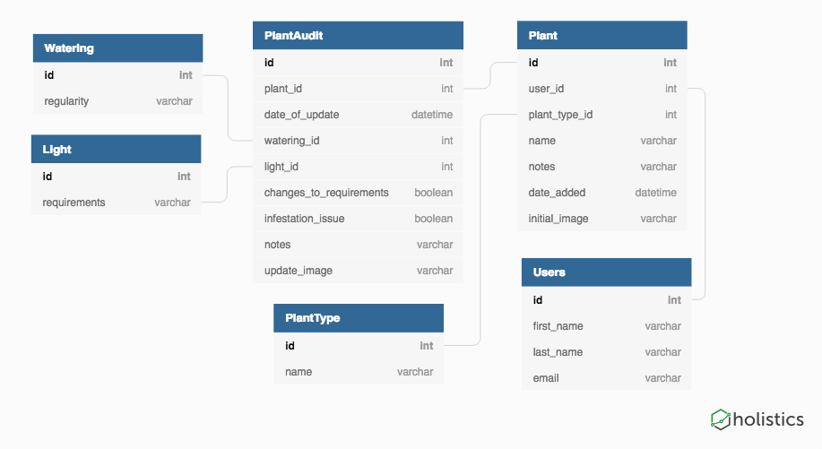
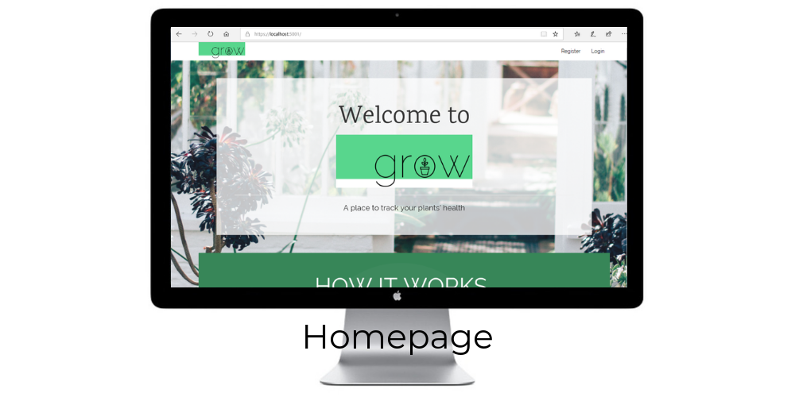
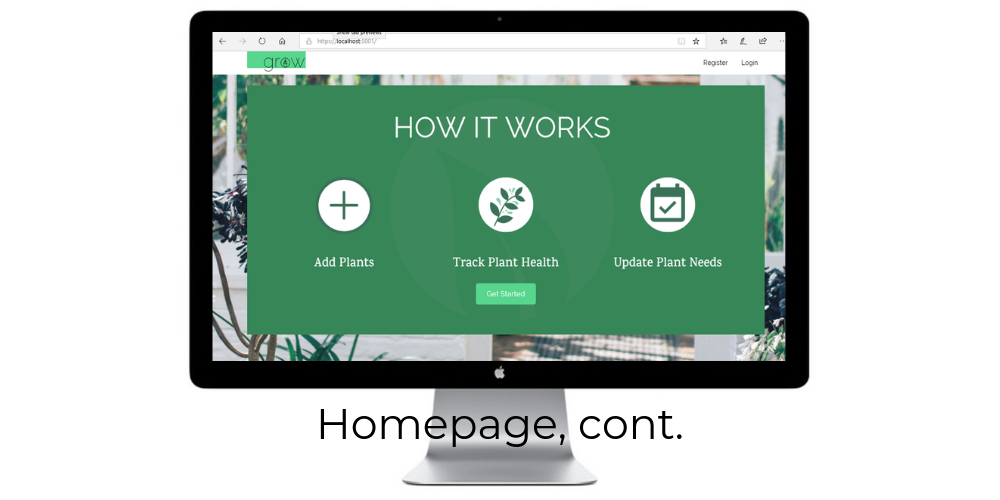
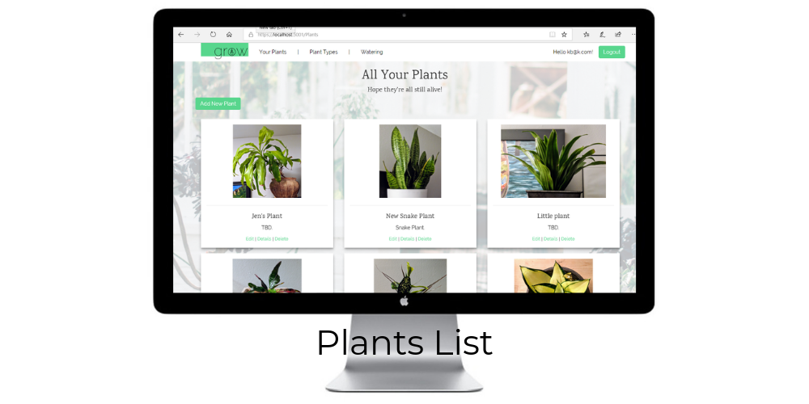
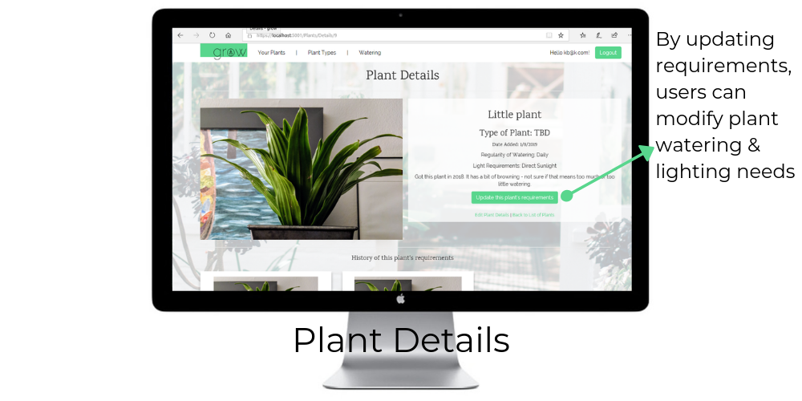
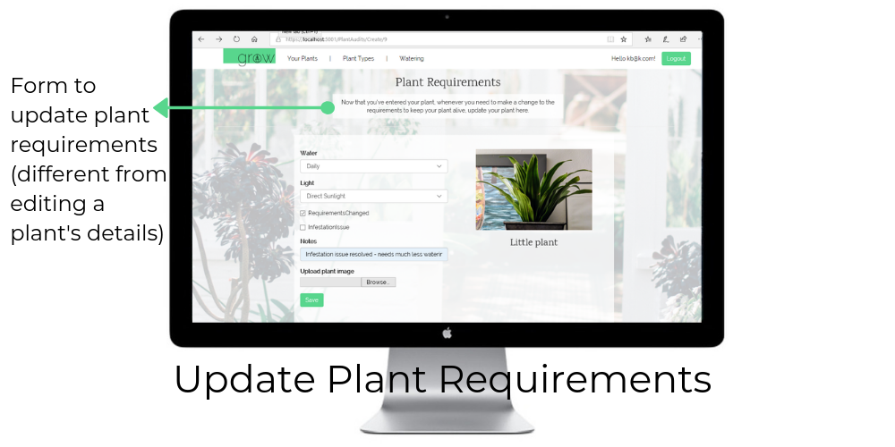
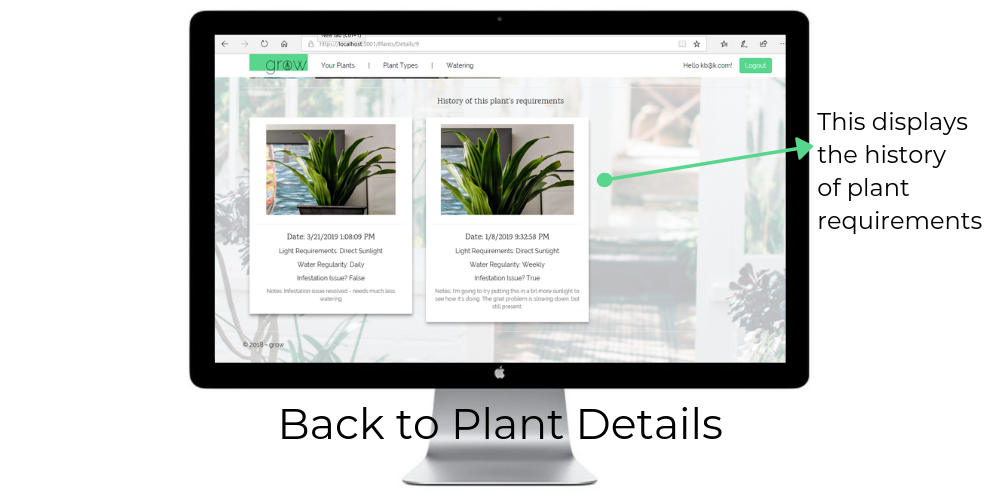
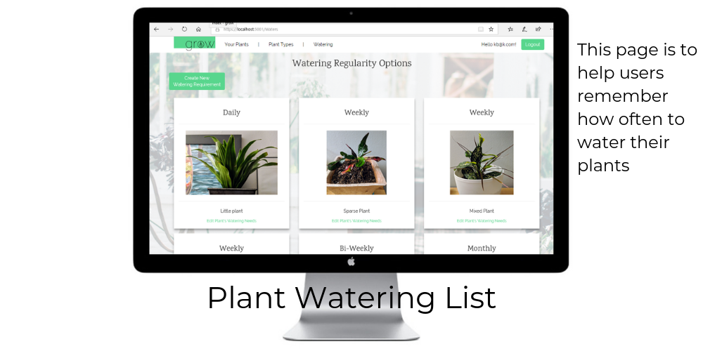
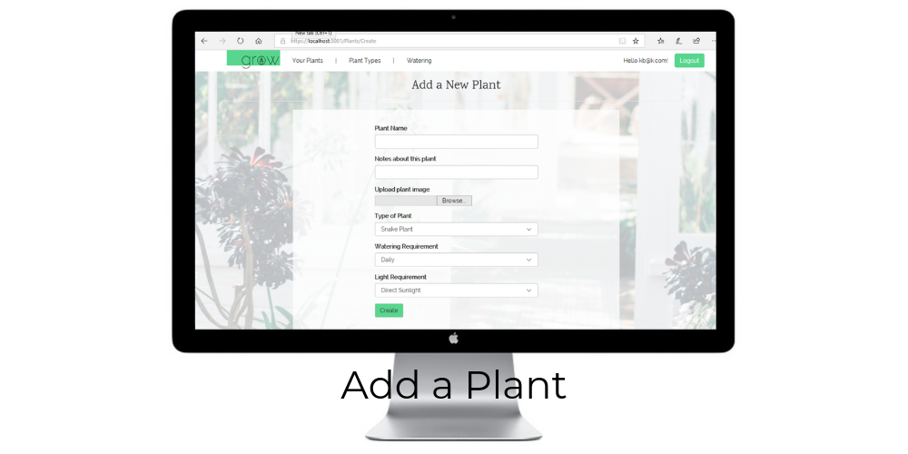

# Welcome to Grow!

## Overview

Grow is my attempt to build an app that will help me track my houseplants. My husband got me a houseplant monthly subscription and it's been challenging to keep the plants alive and thriving! The goal with this app is to enter each of your plants, along with periodic updates to optimize the watering, lighting, and other needs of each plant.

Grow implements the Identity framework, and extends the base User object with the `ApplicationUser` model.

### Grow ERD


## Grow Functionality

<details><summary>App Screenshots</summary>
<p>









</p>
</details>

## App functionality
1. Register/log in
1. Add plants with estimated watering and lighting requirements
1. Edit plant general details
1. Edit plant water and/or lighting requirements
1. Delete a plant
1. View all plants
1. View plants by watering requirements

As users notice a plant that is not thriving, they can update the plant's water and/or lighting requirements. The history of these changes is displayed on each plant detail, so a user can track and optimize each plant's needs.

## Setup

### Git and SQL Server Configuration

1. Clone this repository to your machine.
1. Create a new repository.
1. Copy the connection string for your repo.
1. From your project directory, execute the following commands
    ```sh
    git remote remove origin
    git remote add origin <paste Github URL here>
    ```
1. Push up the master branch to your new remote origin
1. Create a branch named `initial-setup`.
1. Go into the project directory and set up your appsettings
    ```sh
    cd Grow
    dotnet restore
    cp appsettings.json.template appsettings.json
    ```
1. Open Visual Studio and has loaded the solution file
1. Once your IDE is running, you'll have to update your new `appsettings.json` file with the following content. Update to your SQL Server name.
    ```json
    {
      "ConnectionStrings": {
        "DefaultConnection": "Server=YourServerHere\\SQLEXPRESS;Database=BangazonSite;Trusted_Connection=True;"
      },
      "Logging": {
        "LogLevel": {
          "Default": "Warning"
        }
      },
      "AllowedHosts": "*"
    }
    ```

### Generating the Database

Once your appsettings are updated and you've entered in some seed data, you should generate your database.

1. Go to the Package Manager Console in Visual Studio.
1. Use the `Add-Migration GrowTables` command.
1. Once Visual Studio shows you the migration file, execute `Update-Database` to generate your tables.
1. Use the SQL Server Object Explorer to verify that everything worked as expected.


